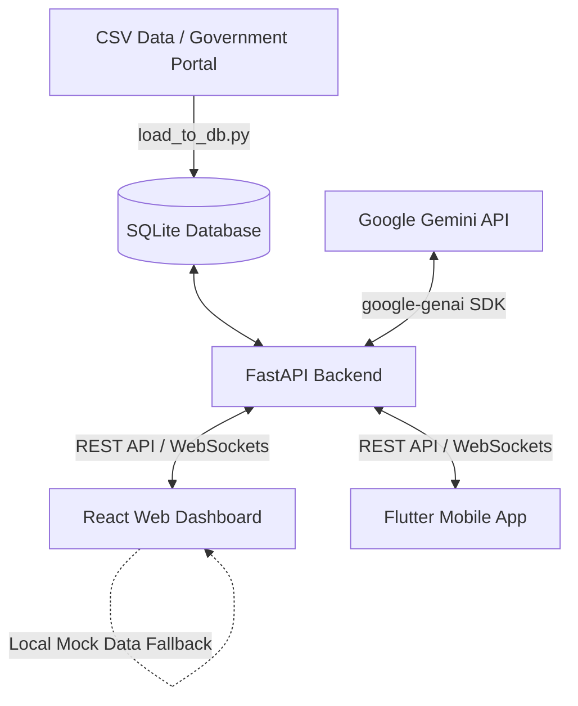

# 🏛️ Hisab Kitab - Indian Budget Intelligence Platform

[](https://opensource.org/licenses/MIT)
[](https://fastapi.tiangolo.com/)
[](https://react.dev/)
[](https://flutter.dev/)
[](https://deepmind.google/technologies/gemini/)

A modern, ML-powered real-time tracking, anomaly detection, and smart fund reallocation platform for public finance. **Hisab Kitab** ("Accounts/Bookkeeping" in Hindi) monitors Indian Government budget distribution, analyzes utilization efficiency, flags fiscal anomalies (underspending, overspending, delays), and provides intelligent reallocation strategies to optimize public resource utility.

---

## 🌟 Table of Contents

- [🏛️ Hisab Kitab - Indian Budget Intelligence Platform](#️-hisab-kitab---indian-budget-intelligence-platform)
  - [🌟 Table of Contents](#-table-of-contents)
  - [🚀 Key Features](#-key-features)
  - [🛠️ Architecture \& Tech Stack](#️-architecture--tech-stack)
  - [📂 Project Directory Structure](#-project-directory-structure)
  - [📊 Core Dataset \& SQLite Schema](#-core-dataset--sqlite-schema)
    - [Dataset Statistics](#dataset-statistics)
    - [SQLite Tables Schema](#sqlite-tables-schema)
      - [`budget` Table](#budget-table)
      - [`users` Table](#users-table)
  - [🔒 Role-Based Authentication](#-role-based-authentication)
  - [🤖 Gemini Budget AI Integration](#-gemini-budget-ai-integration)
  - [📡 WebSocket Real-time Alerts](#-websocket-real-time-alerts)
  - [⚙️ Setup \& Running Locally](#️-setup--running-locally)
    - [Prerequisites](#prerequisites)
    - [1. Backend Setup (FastAPI + SQLite)](#1-backend-setup-fastapi--sqlite)
    - [2. Admin Dashboard Setup (React + Vite)](#2-admin-dashboard-setup-react--vite)
    - [3. Mobile Application Setup (Flutter)](#3-mobile-application-setup-flutter)

---

## 🚀 Key Features

1. **Analytical Executive Dashboard (React + Recharts)**
   - High-level KPIs (Total budget allocated vs. spent, overall utilization percentage, anomaly counts).
   - Interactive charts filtering allocation by ministry, department, and spending phase.
   - Geospatial leakage maps and district development trend visualizations.
2. **Machine Learning Anomaly Detection**
   - Utilizes an unsupervised **Isolation Forest** model to detect irregular spending velocities and delays.
   - Classifies risk levels (High, Medium, Low) based on spending utilization thresholds (>150% or <30%) and implementation delays (>90 days).
3. **Smart Reallocation Algorithm**
   - Suggests optimizing under-utilized funds from low-performing districts/schemes and reallocates them to high-priority, high-performing areas facing budget deficits.
4. **Interactive Budget AI (Gemini Flash)**
   - Conversational assistant powered by `google-genai` client SDK (`gemini-flash-lite-latest`).
   - Dynamically pulls live database state statistics and feeds them into system prompts, enabling intelligent context-aware analysis.
5. **Real-time Alert Engine (WebSockets)**
   - Real-time notification channel pushing critical warnings (such as extreme underspending or delayed releases) to administrative client applications.
6. **Robust Schema-Validated Data Ingestion**
   - Admin upload panel validating CSV structure against required government database templates before committing transaction updates.

---

## 🛠️ Architecture & Tech Stack



- **Backend Service**
  - **Framework:** FastAPI (Python 3.10+)
  - **Database:** SQLite 3 (Indexed search queries)
  - **AI SDK:** `google-genai` (utilizing `gemini-flash-lite-latest`)
  - **Data Processing & ML:** Pandas, NumPy, Scikit-learn (Isolation Forest)
  - **Security:** PyJWT, Bcrypt (Role-Based Access Control)
- **Web Admin Portal**
  - **Framework:** React 18, Vite
  - **Styling:** Tailwind CSS, PostCSS
  - **State Management:** Zustand
  - **Data Visualization:** Recharts
  - **Transitions:** Framer Motion
- **Mobile Native Application**
  - **Framework:** Flutter SDK (Dart)
  - **Data Vis:** `fl_chart`
  - **Session Management:** `shared_preferences`

---

## 📂 Project Directory Structure

```text
COHERENCE-26_Git-Ignite/
│
├── data/                               # Raw datasets
│   └── india_govt_fund_allocation.csv  # Core budget csv dataset (12,000 records)
│
├── backend/                            # FastAPI Server
│   ├── main.py                         # API server & WebSocket endpoints (2,300+ lines)
│   ├── load_to_db.py                   # Data ingestion script to SQLite database
│   ├── fix_hashes.py                   # Script to reset/fix developer credentials
│   ├── budget_india.db                 # SQLite database file containing budget & users tables
│   └── .env                            # Backend configuration (GEMINI_API_KEY)
│
├── frontend/                           # App clients
│   ├── admin-dashboard/                # Vite React Admin Dashboard
│   │   ├── src/
│   │   │   ├── components/             # Reusable UI elements (KPIs, Charts, Sidebar)
│   │   │   ├── pages/                  # Dashboard sections (Anomaly, Smart Reallocate)
│   │   │   ├── hooks/                  # Store configuration & custom fetch hook
│   │   │   ├── App.jsx                 # Routing and layout definitions
│   │   │   └── main.jsx
│   │   ├── tailwind.config.js          # Tailwind customization
│   │   └── package.json
│   │
│   └── hisab_kitab/                    # Flutter Mobile Application
│       ├── lib/
│       │   ├── main.dart               # Complete Flutter app code (140KB+)
│       │   └── main_backup.dart
│       ├── pubspec.yaml                # Flutter project specifications & dependencies
│       └── assets/                     # Shared logo assets
│
├── preview_data.py                     # Root script for profiling local CSV
├── write_main.py                       # Code writer helper script for local syncs
├── .gitignore                          # Excluded build artifacts and node modules
└── README.md                           # Platform documentation (This file)
```

---

## 📊 Core Dataset & SQLite Schema

### Dataset Statistics
- **Total Records:** 12,000
- **Granularity:** State ➔ District ➔ Ministry ➔ Department ➔ Scheme
- **Temporal Coverage:** 2021 to 2024 (Quarterly & Monthly phases)

### SQLite Tables Schema

#### `budget` Table
Aggregated records of financial transactions, including:
- `Project_ID` (TEXT Primary Key): Unique project code.
- `Allocated_Budget_Cr` / `Revised_Budget_Cr` / `Actual_Spending_Cr` (REAL): Budget values in Crores (₹).
- `Remaining_Budget_Cr` / `Utilization_Percentage` (REAL): Computed financial values.
- `Population_Covered` / `Beneficiary_Count` (INTEGER): Social impact markers.
- `District_Development_Index` (REAL): Socio-economic development scale (0-1).
- `Delay_Days` (INTEGER): Delayed project implementation timeline.
- `Anomaly_Tag` (TEXT): Classification tags (`Normal`, `Underspending`, `Overspending`, `Delayed Release`, `High Risk`).

#### `users` Table
Stores user registration for secure authentication:
- `username` (TEXT Unique)
- `email` (TEXT Unique)
- `full_name` (TEXT)
- `hashed_password` (TEXT)
- `role` (TEXT: `admin`, `department`, `public`)
- `department` (TEXT: Optional - e.g., `Health`, `Education`)
- `disabled` (BOOLEAN)

---

## 🔒 Role-Based Authentication

The platform secures key analysis dashboards through JSON Web Tokens (JWT). Default credentials for local testing:

| Username | Password | Role | Access / Department Scope |
| :--- | :--- | :--- | :--- |
| `admin` | `admin123` | **Admin** | Unrestricted Global Access |
| `health_dept` | `admin123` | **Department** | Restricted to Health Department Data |
| `education_dept` | `admin123` | **Department** | Restricted to Education Department Data |
| `public_user` | `admin123` | **Public** | Public API Summaries & General Analytics |

---

## 🤖 Gemini Budget AI Integration

The conversational AI interface is powered by Google Gemini.
- **Client Integration:** Handled inside the backend via `google-genai` Python library.
- **Dynamic Context Injection:** On each prompt, the backend executes SQL aggregations (Total Allocated, Spent, Average Utilization, Anomaly totals) and injects this summary straight into the Gemini system instructions.
- **Result:** Accurate financial question-answering without exposing full database queries to external systems, optimizing speed and context size.

---

## 📡 WebSocket Real-time Alerts

Real-time notification engine works via custom WebSockets on path `/ws/alerts`.
- **Logic:** The backend tracks connected sessions and triggers background polling tasks (every 30 seconds). It picks critical records showing underutilization (<30% utilization) and pushes notification objects down the websocket pipeline.
- **Client Integration:**
  - *React Web Dashboard:* Listens and toasts live warnings.
  - *Flutter Mobile:* Streams and displays alerts on a dedicated notifications view.

---

## ⚙️ Setup & Running Locally

### Prerequisites
- Python 3.10+
- Node.js 18+ & npm
- Flutter SDK & Android Studio / iOS Simulator (for mobile build)

---

### 1. Backend Setup (FastAPI + SQLite)

1. Navigate to the backend directory:
   ```bash
   cd backend
   ```
2. Install Python dependencies:
   ```bash
   pip install -r requirements.txt
   ```
   *Note: Ensure libraries `fastapi`, `uvicorn`, `pandas`, `scikit-learn`, `bcrypt`, `python-jose`, `google-genai`, `python-dotenv` are installed.*
3. Populate database with CSV data:
   ```bash
   python load_to_db.py
   ```
4. Define your Gemini API key in a `.env` file inside the `backend` folder:
   ```env
   GEMINI_API_KEY=your_gemini_api_key_here
   ```
5. Run the FastAPI development server:
   ```bash
   fastapi dev main.py
   ```
   *The server starts on `http://localhost:8000`. API Swagger Docs are available at `http://localhost:8000/docs`.*

---

### 2. Admin Dashboard Setup (React + Vite)

1. Navigate to the admin dashboard directory:
   ```bash
   cd frontend/admin-dashboard
   ```
2. Install dependencies:
   ```bash
   npm install
   ```
3. Start Vite dev server:
   ```bash
   npm run dev
   ```
   *The portal will open at `http://localhost:5173`. It checks for the FastAPI backend; if offline, it will seamlessly fall back to local Mock datasets.*

---

### 3. Mobile Application Setup (Flutter)

1. Navigate to the mobile client directory:
   ```bash
   cd frontend/hisab_kitab
   ```
2. Pull Dart package dependencies:
   ```bash
   flutter pub get
   ```
3. Update server endpoint inside `lib/main.dart` if running on a physical device:
   ```dart
   const String kBaseUrl = 'http://YOUR_LOCAL_IP:8000';
   ```
4. Run application:
   ```bash
   flutter run
   ```
